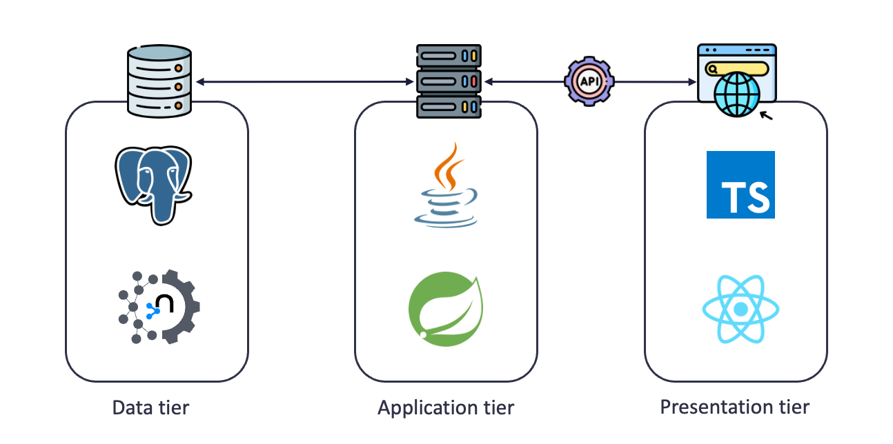

# Technical Manual

## Architecture

### Overview

The app makes use of a three-tier architecture:

- The **presentation tier** is the user interface and communication layer of the application where the end user interacts with the application. Its main purpose is to display the information to and collection information from the user. This top-level runs on a web browser developed with [TypeScript](https://www.typescriptlang.org/) using the [React](https://react.dev/) framework and [PrimeReact](https://primereact.org/) as UI library.
- The **application tier** handles the processing of the collected information using business logic and also commands the create, retrieve, update and delete (CRUD) operations to the data tier. This tier was implemented using [Java](https://www.java.com/en/) and [Java Spring Framework](https://spring.io/projects/spring-framework). 
- The **data tier** stores and manages the processed information. In this case we used a combination of [Neo4J](https://neo4j.com/?utm_source=Google&utm_medium=PaidSearch&utm_campaign=Evergreenutm_content%3DEMEA-Search-SEMBrand-Evergreen-None-SEM-SEM-NonABM&utm_term=neo4j&utm_adgroup=core-brand&gad_source=1&gclid=CjwKCAjwt-OwBhBnEiwAgwzrUhDCEbGSeBJx0MDVMdRXM5zwzu_aYKslkAuRgKEhKNbdmj-9XX-wIBoC48UQAvD_BwE) and [PostgreSQL](https://www.postgresql.org/) that handle the Graph Knowledge data and Users and lookups data respectively.

The following diagram illustrates the architecture of the OneHealth application



Some of the advantages of this architecture are:

- Scalability: Each tier can be scaled independently as needed. For example we can scale the server of the data tier as we integrate information about more countries without increasing the resources for the application and presentation tiers.
- Maintainance: Each tier can be maintained independently, so different developers can work in the different tiers according to their skills.

### Software


## User Flows

- User:
  - Explore the graph
  - Co-ocurrence Search
  - Queryin
- Curator:
  - CRUD
- Administrator:
  - Name curators
  - Other administrative stuff

### Modules

#### Metadata Definition

#### Data Load

#### Knowledge Graph Exploration

#### Co-Occurrences Search


# Frontend

## Architecture Overview

### Dependencies

- **bootstrap**: CSS framework for layout [[Read documentation]](https://getbootstrap.com/docs/5.3/getting-started/introduction/) [[MIT License](https://github.com/twbs/bootstrap/blob/main/LICENSE)]

- **primereact**: UI components library for react [[Read documentation](https://primereact.org/)] [[MIT License](https://github.com/primefaces/primereact/blob/master/LICENSE.md)]
- **primeicons**: UI icons library for react [[Read documentation](https://primereact.org/icons/)] [[MIT License](https://github.com/primefaces/primeicons/blob/master/LICENSE)]
- **fontawesome-free**: Free version icon library and toolkit [[Read documentation](https://github.com/FortAwesome/Font-Awesome)] [[Free License](https://github.com/FortAwesome/Font-Awesome/blob/6.x/LICENSE.txt)]
- **react-router-dom**: Client side routing library [[Read documentation](https://reactrouter.com/en/main/start/overview)] [[MIT License](https://github.com/remix-run/react-router/blob/main/LICENSE.md)]
- **axios**: HTTP client for the browser [[Read documentation](https://github.com/axios/axios)] [[MIT License](https://github.com/axios/axios/blob/v1.x/LICENSE)]
- **inversify**: An inversion of control (IoC) container for dependency injection in React [[Read documentation](https://github.com/inversify/InversifyJS)] [[MIT License](https://github.com/inversify/InversifyJS/blob/master/LICENSE)]
- **reflect-metadata**: Metadata reflection API needed to use **inversify** [[Read documentation](https://github.com/rbuckton/reflect-metadata)] [[Apache 2.0 License](https://github.com/rbuckton/reflect-metadata/blob/main/LICENSE)]
- **cytoscape**: Graph theory library for visualization and analysis [[Read documentation](https://js.cytoscape.org/)] [[MIT License](https://raw.githubusercontent.com/cytoscape/cytoscape.js/master/LICENSE)] 
- **react-cytoscapejs**: React component wrapper for Cytoscape graphs [[Read documentation](https://github.com/plotly/react-cytoscapejs)] [[MIT License](https://raw.githubusercontent.com/plotly/react-cytoscapejs/master/LICENSE)] 
- **cytoscape-ctxmenu**: Context menu extension for Cytoscape [[Read documentation](https://github.com/cytoscape/cytoscape.js-cxtmenu)] [[MIT License](https://github.com/cytoscape/cytoscape.js-cxtmenu/blob/master/LICENSE)]
- **plotly.js**: A library for interactive data visualization [[Read documentation](https://plotly.com/javascript/)] [[MIT License](https://github.com/remix-run/react-router/blob/main/LICENSE.md)]
- **react-plotly.js**: React component wrapper for Plotly graphs [[Read documentation](https://github.com/plotly/react-plotly.js)] [[MIT License](https://raw.githubusercontent.com/plotly/react-plotly.js/master/LICENSE)]
- **openchemlib-js**: Open source javascript chemistry library [[Read documentation](https://cheminfo.github.io/openchemlib-js/modules.html)] [[BSD-3-Clause License](https://github.com/remix-run/react-router/blob/main/LICENSE.md)]
- **qs**: A querystring parsing and stringifying library [[Read documentation](https://github.com/ljharb/qs)] [[BSD-3-Clause License](https://raw.githubusercontent.com/ljharb/qs/main/LICENSE.md)]

## Features

### Services

Services are in charge to stablish communication with the backend: sending requests, receiving DTOs and transforming the DTOs into our TypeScript objects


The BaseDataService class provides a functionality to asynchronously send requests to an API using Axios, retrieve the result and transform it into a TResult object.

``` typescript
@injectable()
export abstract class BaseDataService {
  
    protected handleRequest<TResult>(
  			request: Promise<AxiosResponse<TResult, any>>,
        responseHandler?: IHttpResponsesHandler
    ): Promise<TResult> {...}
        
}
```

This data service is used as an starting point for our services class hierarchy

The CrudService provides functionality for sending basic crud requests to the API

```typescript
* @extends BaseDataService
@injectable()
export class CrudService<TEntity> extends BaseDataService {
    get(id: number | string, toast : RefObject<Toast>, httpResponseHandlerSettings? : IHttpResponseHandlerSettings): Promise<TEntity> {...};

    getAll(toast : RefObject<Toast>,  httpResponseHandlerSettings? : IHttpResponseHandlerSettings): Promise<TEntity[]> {...};

    create(item: TEntity, toast : RefObject<Toast>, httpResponseHandlerSettings? : IHttpResponseHandlerSettings): Promise<TEntity> {...};
                                                                                                                                    
    update(id: number | string, item: TEntity, httpResponseHandlerSettings? : IHttpResponseHandlerSettings) : Promise<TEntity> {...};
                                                                                                                                
    delete(id: number | string, httpResponseHandlerSettings? : IHttpResponseHandlerSettings) : Promise<any> {...};
                                                                                                             
    deleteAll(httpResponseHandlerSettings? : IHttpResponseHandlerSettings): Promise<any> {...};
}
```

The PagedCrudService provides functionality to retrieve data using filtering, sorting and pagination options. It is able to transform a query object into a http request with all the given query parameters.

```typescript
@injectable()
export class PagedCrudService<TEntity> extends CrudService<TEntity> {
    
    getPage(queryCommand: IQueryCommand,toast : RefObject<Toast>, httpResponseHandlerSettings?: IHttpResponseHandlerSettings) : Promise<any> {...}
                                                                                                             }
```

### Dependency Injection

In order to use depedency injection to provide the data services to the components we need to setup [InversifyJS](https://github.com/inversify/InversifyJS) 

To do this you can find the feature/injection

```typescript
const dependencyFactory = new Container();
dependencyFactory.bind<IEntityTypeService>(SERVICE_TYPES.IEntityTypeService).to(EntityTypeService);
dependencyFactory.bind<IKeywordService>(SERVICE_TYPES.IKeywordService).to(KeywordService);
dependencyFactory.bind<ILinkTypeService>(SERVICE_TYPES.ILinkTypeService).to(LinkTypeService);
dependencyFactory.bind<IPropertyService>(SERVICE_TYPES.IPropertyService).to(PropertyService);
dependencyFactory.bind<IDataSourceService>(SERVICE_TYPES.IDataSourceService).to(DataSourceService);
dependencyFactory.bind<IMetadataService>(SERVICE_TYPES.IMetadataService).to(MetadataService);
dependencyFactory.bind<IOntologyService>(SERVICE_TYPES.IOntologyService).to(OntologyService);

export { dependencyFactory };
```


Using the dependency factory

```typescript
const entityService = dependencyFactory.get<IEntityTypeService>(SERVICE_TYPES.IEntityTypeService);
```

### Data Visualization

For traditional data visualization we selected the graphing library [PlotlyJS](https://plotly.com/javascript/) and incorporated this to the project using the [react-plotly.js](https://github.com/plotly/react-plotly.js) package


### Graph Visualization

For graph visualization we selected [Cytoscape](https://js.cytoscape.org/) and incorporated this into our project using 

### Chemistry Tools

# Backend

### Architecture Overview

### Models

### Repositories

### Services

### Controllers


